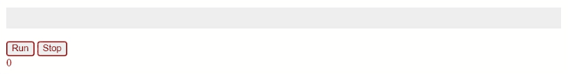

# frontend-micro-challenges

- [All challenges](https://sachinkumar579.github.io/frontend-micro-challenges/)

> Demo of 1 such project - Progress Bar Advanced

- This is a progress bar created using HTML , Javascript and CSS
- It has a loading bar , 2 buttons and a display section for time
- It runs for 5 secs . It starts loading when you click on Run and stops when you click on Stop
- The time is displayed as it loads
- It uses closure concepts for logic building and setTimeout method to keep track of time

> Progress Bar Advanced Demo

- Check it out here [Click here](https://sachinkumar579.github.io/frontend-micro-challenges/progress-bar-advanced/)
